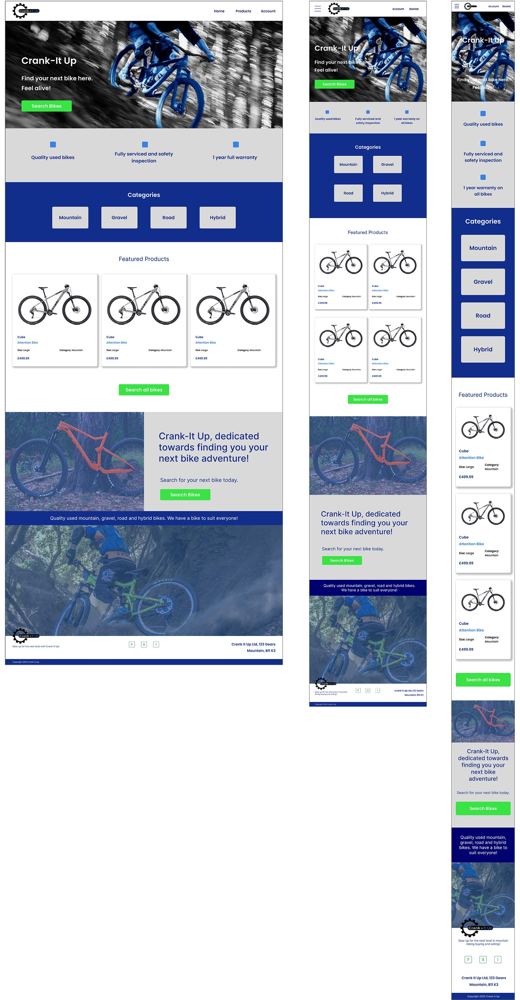
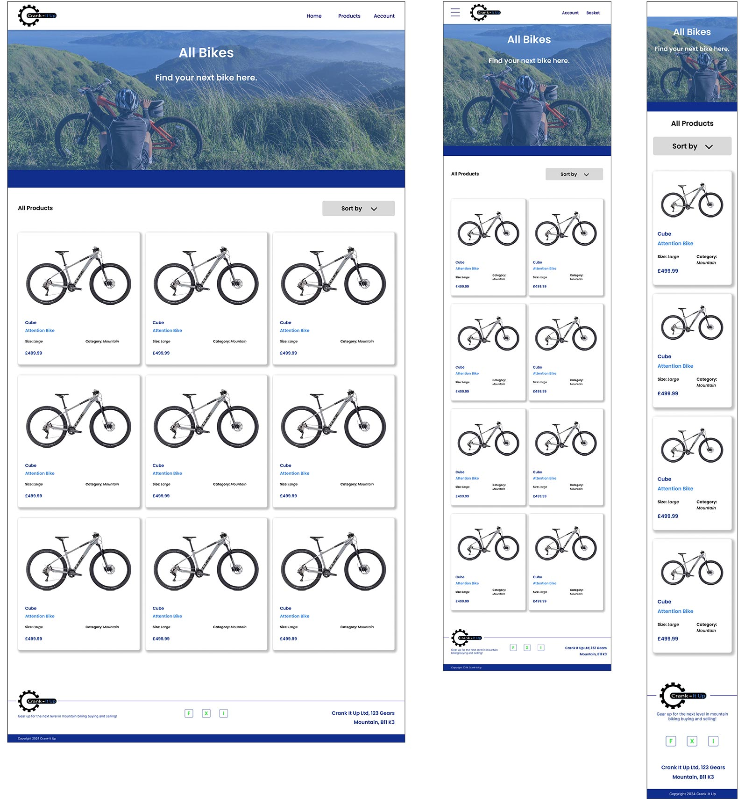
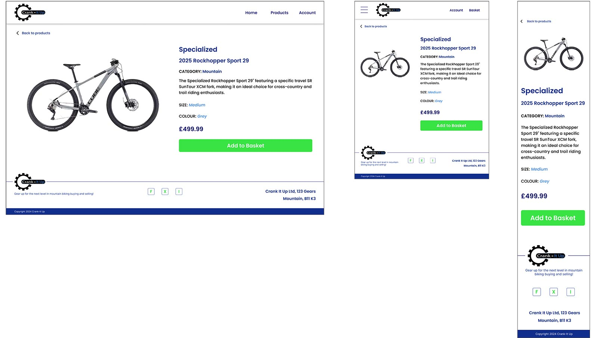
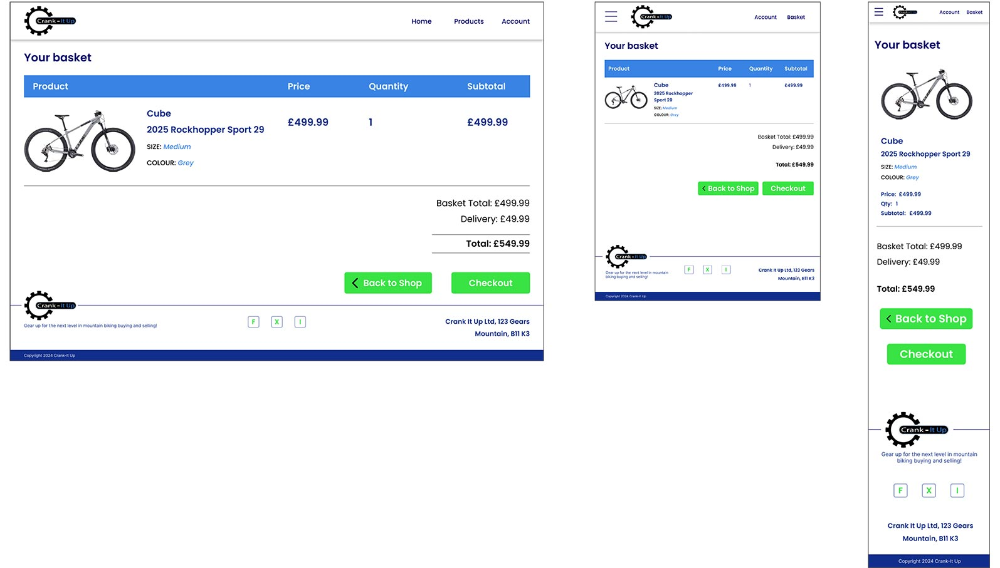
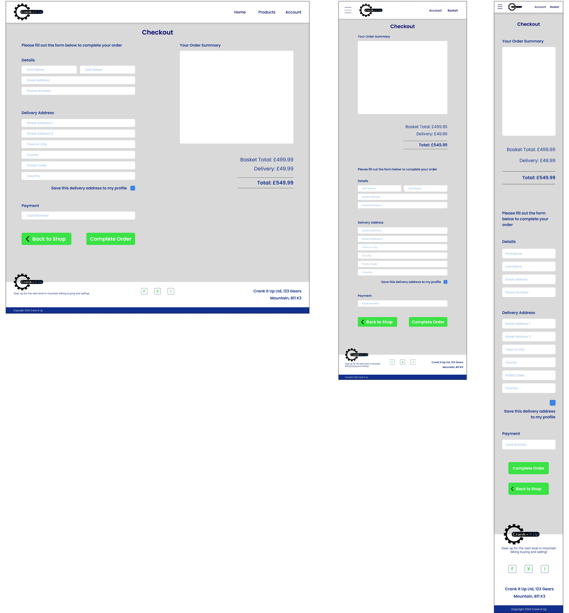
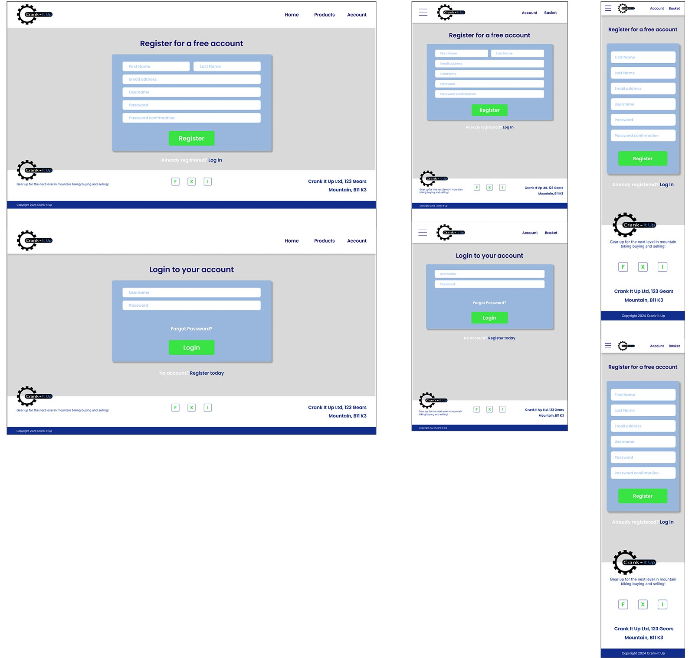
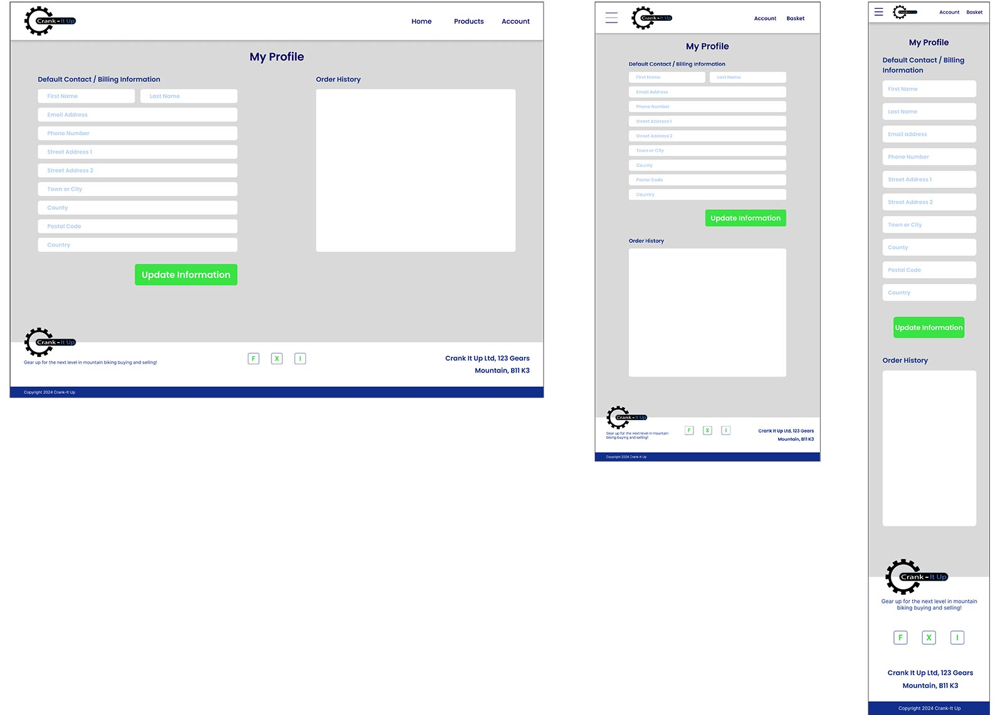
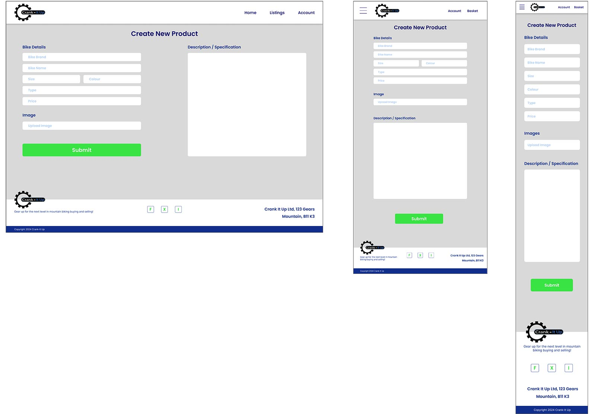
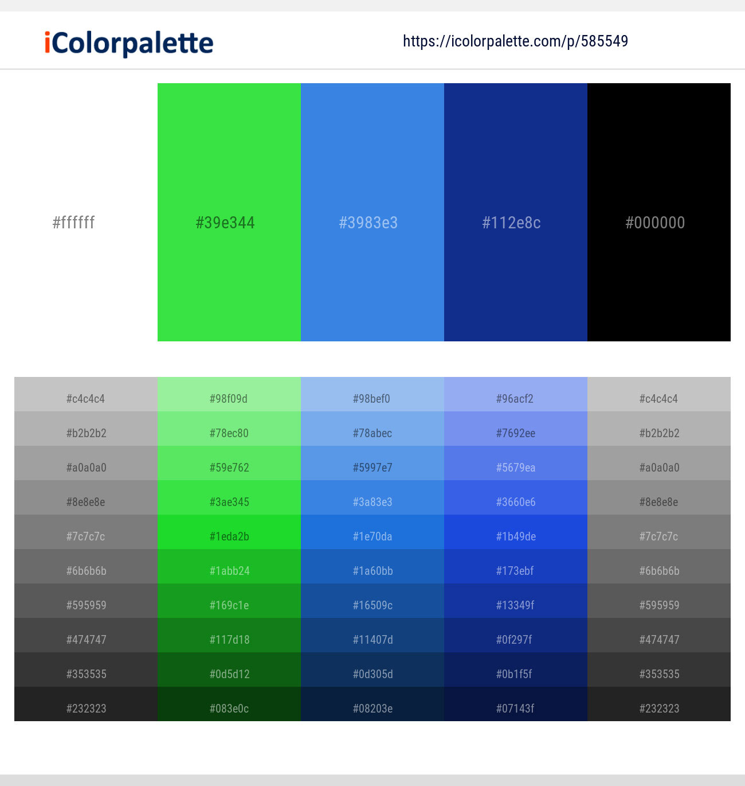
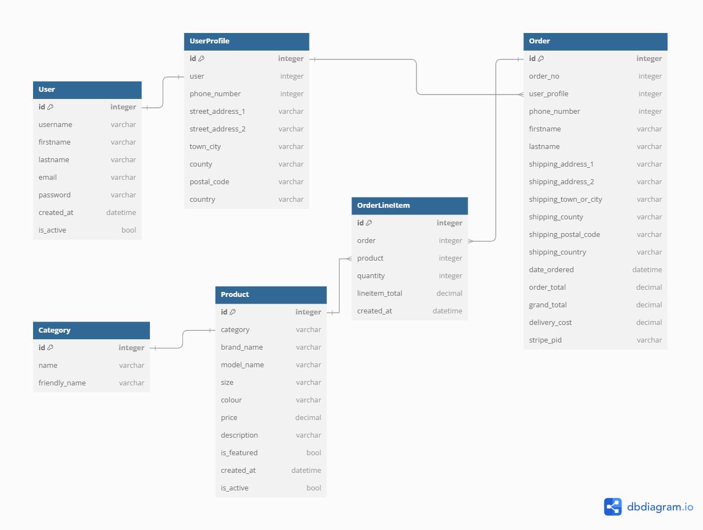

# Crank-it Up

---

## About

Crank-it Up is a full-stack ecommerce website that allows users to purchase quality used bikes. The user can browse either by all bikes or can choose a category that will take them to specific bikes. As the bikes are either custom or used no quantities will be necessary as these are one-off bikes to be purchased. The bikes on the product page can be sorted via price, name or category. Users will be able to add products to their basket and checkout securely using Stripe. Users will be able to register for an account and perform full CRUD functionality on their personal details and will also be able to see their purchase history.

The site will be targeted towards individuals who want a no nonsense, quick and easy way to purchase used quality bikes.

***Click **[here]()** to view the live website.***

---

## User Experiences (UX)

### **User Stories**

**Viewing and Navigation**

+ View a list of bikes - I can see which bike(s) I would like to purchase
+ View individual details about the bikes - I can see the price, description, product image and sizes
+ See the featured listings by default - I can see quickly and easily the featured bikes available to purchase
+ Easily view the bike(s) and the total purchase at any time - I can see how much I am spending
+ Clearly see the categories (Mountain, Gravel, Road and Hybrid) available for selection - I can see these from within the navbar and the home page

**Registration and User Accounts**

+ Easily register for an account - I can have a personal account to see and edit my profile and see purchase history
+ Easily login or logout - I can see my personal details within my account
+ Easily recover my password - I can recover access to my account
+ Have a personalised user profile - I can view my order history, update billing info, save payment information
+ Receive an email confirmation after registering - I can see that my account was successfully setup

**Sorting and Searching**

+ Sort products by brand name, price and category - I can narrow down my search to identify a specific bike to buy
+ Search for a product by name or description - I can find a specific bike I'd like to buy
+ See what I've searched for and the results - I can see whether the product I'd like to buy is in the results
+ See if there are no search results - I can quickly determine that there are no products that match

**Purchasing and Checkout**

+ View items in the basket - I can see exactly what I'm ordering and how much the total cost will be
+ Easily enter my payment information - I can checkout with no issues
+ Feel my personal details and payment information is secure - I can have the confidence to provide and input my payment details
+ View an order confirmation after checkout - I can make sure my order has gone through successfully and I haven't made any mistakes
+ Receive an email confirmation after checkout - I can have confirmation and proof of purchase for my records

### **Strategy**

**Site Goals**

This project is based around creating a full-stack ecommerce website that allows users to browse and purchase products, utilising Django framework, HTML, CSS, Javascript, Python, Stripe Payments and a Relational Database.

The main goal of the website is to allow users to browse and purchase quality used bike(s). They have the option to register for an account that will allow them to add, edit/update there personal details. Full CRUD functionality will be available to the user throughout their account.
The website will need to be of a professional outlay with an attractive design that is both modern and simple to navigate. The site will need to be fully responsive allowing for the site to look great on all devices.

### **Scope**

The main features for this website are to provide users with the ability to register for an account, then login and access there very own dashboard. Then by utilising full crud functionality they will be able to create, read, update and delete both locations and items.

**Homepage**

The homepage will start out with a 3/4 full width jumbotron that will immediately draw the attention to the user and allow the user to easily identify that the site is about buying their next bike. There is a button on the jumbotron that will take the user directly to the products page to see all the bikes. Throughout the home page there will be areas that have both relevant images and text to showcase to the user what the business has to offer.

Below the jumbotron will be a section containing the four categories, mountain, gravel, road and hybrid. Clicking on any of these categories will take the user to the products page, with only the bike's showing for that particular category. There will be a featured section just down from the categories that will showcase certain bikes that the admin feels like they want the user to be made aware of.

**Navbar / Footer**

The navbar that shows on every page will show to the left, the logo, followed by a dropdown for the products. To the right, the account and basket links. Centrally in the navbar will be the search bar. By having the search bar visible on the site, users of all abilities will easily be able to simply click and search with very minimalistic effort.
The footer at the bottom of each page will be simplistic in style, showcasing the company strapline, social media links and an address.

**Login / Register**

Both these pages have been made to look and feel the same for consistency. The colours used are in keeping with the theme of the site and are bold to make them stand out. Both have a centralised form that is easy to fill out with a button below the form to submit. Below both forms will be a link that takes them to the other page should they have gone to the wrong one in the first place.

**Product Page**

The products page will again showcase a jumbotron that will have an overlay text, which shows the category name. So that this image is in keeping with other images within the homepage, it will have a blue tinted overlay. At the top of the page will be text that shows how many products a certain category holds and also a dropdown menu to sort the products by brand name, category and price.
The cards that make up the products have been kept simple with a white background and a drop shadow around them so that they stand out without being too overpowering. Each product container has the bike image and it's details below the image.

**Product Landing Page**

Once a product has been clicked on, the user will be taken to the product landing page which will drill down into the product with more detail available. This page is split into two half's with the left side having the bike image, this image can be clicked on so that the user can see a bigger image of the bike. The right side containing all the bike details. The user can check the details of the bike they would like to purchase and then simply Add to Basket.
If the user has clicked on the wrong product, they will see a back to products link at the top of the page that will take them back to the product page containing all the bikes.

**Basket**

The basket is made up of a table containing the product image and the main header details. Each product that the user adds to there basket will show here. Below the product(s) will be the cost totals and the delivery, allowing the user to easily identify how much they are spending in total. The buttons below the costs will allow the user to navigate directly to the checkout or allow them to keep shopping by taking them back to the products page containing all the bikes.

**Checkout**

The checkout page is kept simple. At the top of the page will be a table containing the item and the total. Just like the basket the cost totals and the delivery costs will be after so that the user is given another look as to what they are spending and which products they are purchasing.
This detail is followed by a form for the user to fill out, containing the users personal details, address details and payment. The user will be given the opportunity to also be able to either login or register so that they can save their information.

**Profile Page**

The profile page has a similar sort of layout to the login and register pages. It contains a full grey background, which is split into two half's. The left side allowing the user to add / update contact billing information. The right side contains the users purchase history.

### **Structure**

The structure of the site will be a series of multiple webpages linked together through carefully thought out buttons and icons. The user will clearly be able to identify what the site is about and how they navigate through the site with easily identifiable buttons and text clearly stating where they will be taken to. The navigation throughout will allow the experience to be fluid and should they run into trouble at any point they will be directed straight back to the home page or product page.

### **Skeleton**

Figma has been used to create the design layouts for this site. Figma is a perfect creative tool that allows for a much more extensive design layout to be created rather than just wireframes. This allows for the producing of the site to be more streamlined, and less likely for major issues to occur with the build of the site. These designs allow the whole process of the site creation to be easier and smoother knowing where each element goes and the colours of each element within the site.

Mobile (360 x 640) 
Tablet (1024 x 1366) 
Desktop (1920 x 1080)

#### **Design Layouts**

Home Page

Product Page

Product Landing Page

Basket

Checkout

Register / Login

Profile

Add New Product

### **Surface**

**Colour**

The main colour palette was chosen with the two colours of ice blue and lime green in mind. The palette itself was chosen by researching different colours that would work well together and really provide a bold looking site. Having the site using primarily blues, blacks and white, meant there would be a lot of dark colours throughout. With the lime green used to break up the site adding that all important lightness to really bring the site alive.

Tints and shades of these colours were found at [maketintsandshade.com](https://maketintsandshades.com/).

Colour Palette

**Typography**

Chosen throughout this site was the font Poppins. It was chosen because of its simple look and very easy to read. It is also a very versatile font that has many font weights. This font is available at [Google Fonts](https://fonts.google.com/).

**Images**

The images throughout the site were chosen specifically to showcase to the user the fun factor from purchasing their next bike with Crank It Up. The main homepage image will be black and white with the person and bike coloured in the primary blue, this will really help with making this image stand out to new users. All other images within the site were overlaid with a blue tint. All the sources where the images came from can be found within the [credits](#credits) section.

**Icons**

The icons within the site can be found at [Font Awesome](https://fontawesome.com/). The main icons within the site are the social media links that can be found on each page in the footer. These give the opportunity for the user to go straight to these social media sites to find out the most recent info regarding the business and the web application. The other icons include the section in the homepage that are used to provide short but punchy descriptive text to quickly explain to a user what the site has to offer.

---

## Data Model

### **Database Schema**

Part of the planning stage was to create a database schema. The schema was created using [dbdiagram.io](https://dbdiagram.io/), making sure that each model was carefully thought out in terms of the data that was required to make the site work. This site will use a relational database model using SQLite and Elephant SQL.

Database Schema

**Models**

+ User - This model holds the data containing the users login details
+ UserProfile - This model holds the users personal details for their profile
+ Category - Holds the category information
+ Product - Holds the data for the actual products
+ Order - This model holds the data for the full order details
+ OrderLineItem - This model holds the data for each order line within an order

**Relationships**

Category to Product Model (Relationship: One to One)
Ref: "Category"."id" - "Product"."category"

User to UserProfile Model (Relationship: One to One)
Ref: "User"."id" - "UserProfile"."user"

UserProfile to Order Model (Relationship: One to Many)
Ref: "UserProfile"."id" < "Order"."user_profile"

Product to OrderLineItem Model (Relationship: One to Many)
Ref: "Product"."id" < "OrderLineItem"."product"

Order to OrderLineItem Model (Relationship: One to Many)
Ref: "Order"."id" < "OrderLineItem"."order"

---

