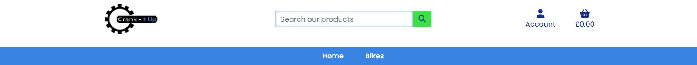

# Crank-it Up

---

## About

Crank-it Up is a full-stack ecommerce website that allows users to purchase quality used bikes. The user can browse either by all bikes or can choose a category that will take them to specific bikes. As the bikes are either custom or used no quantities will be necessary as these are one-off bikes to be purchased. The bikes on the product page can be sorted via price, name or category. Users will be able to add products to their basket and checkout securely using Stripe. Users will be able to register for an account and perform full CRUD functionality on their personal details and will also be able to see their purchase history.

The site will be targeted towards individuals who want a no nonsense, quick and easy way to purchase used quality bikes.

For testing purposes please make sure when entering payment details at the checkout page that you enter the Card Number: 4242 4242 4242 4242 as this is the Stripe testing card number.

***Click **[here](https://django-crank-it-up-a382c0df504c.herokuapp.com/)** to view the live website.***

---

## User Experiences (UX)

### **User Stories**

**Viewing and Navigation**

+ View a list of bikes - I can see which bike(s) I would like to purchase
+ View individual details about the bikes - I can see the price, description, product image and sizes
+ See the featured listings by default - I can see quickly and easily the featured bikes available to purchase
+ Easily view the bike(s) and the total purchase at any time - I can see how much I am spending
+ Clearly see the categories (Mountain, Gravel, Road and Hybrid) available for selection - I can see these from within the navbar and the home page

**Registration and User Accounts**

+ Easily register for an account - I can have a personal account to see and edit my profile and see purchase history
+ Easily login or logout - I can see my personal details within my account
+ Easily recover my password - I can recover access to my account
+ Have a personalised user profile - I can view my order history, update billing info, save payment information
+ Receive an email confirmation after registering - I can see that my account was successfully setup

**Sorting and Searching**

+ Sort products by brand name, price and category - I can narrow down my search to identify a specific bike to buy
+ Search for a product by name or description - I can find a specific bike I'd like to buy
+ See what I've searched for and the results - I can see whether the product I'd like to buy is in the results
+ See if there are no search results - I can quickly determine that there are no products that match

**Purchasing and Checkout**

+ View items in the basket - I can see exactly what I'm ordering and how much the total cost will be
+ Easily enter my payment information - I can checkout with no issues
+ Feel my personal details and payment information is secure - I can have the confidence to provide and input my payment details
+ View an order confirmation after checkout - I can make sure my order has gone through successfully and I haven't made any mistakes
+ Receive an email confirmation after checkout - I can have confirmation and proof of purchase for my records

### **Strategy**

**Site Goals**

This project is based around creating a full-stack ecommerce website that allows users to browse and purchase products, utilising Django framework, HTML, CSS, Javascript, Python, Stripe Payments and a Relational Database.

The main goal of the website is to allow users to browse and purchase quality used bike(s). They have the option to register for an account that will allow them to add, edit/update there personal details. Full CRUD functionality will be available to the user throughout their account.
The website will need to be of a professional outlay with an attractive design that is both modern and simple to navigate. The site will need to be fully responsive allowing for the site to look great on all devices.

### **Scope**

The main features for this website are to provide users with the ability to register for an account, then login and access there very own dashboard. Then by utilising full crud functionality they will be able to create, read, update and delete both locations and items.

**Homepage**

The homepage will start out with a 3/4 full width jumbotron that will immediately draw the attention to the user and allow the user to easily identify that the site is about buying their next bike. There is a button on the jumbotron that will take the user directly to the products page to see all the bikes. Throughout the home page there will be areas that have both relevant images and text to showcase to the user what the business has to offer.

Below the jumbotron will be a section containing the four categories, mountain, gravel, road and hybrid. Clicking on any of these categories will take the user to the products page, with only the bike's showing for that particular category. There will be a featured section just down from the categories that will showcase certain bikes that the admin feels like they want the user to be made aware of.

**Navbar / Footer**

The navbar that shows on every page will show to the left, the logo, followed by a dropdown for the products. To the right, the account and basket links. Centrally in the navbar will be the search bar. By having the search bar visible on the site, users of all abilities will easily be able to simply click and search with very minimalistic effort.
The footer at the bottom of each page will be simplistic in style, showcasing the company strapline, social media links and an address.

**Login / Register**

Both these pages have been made to look and feel the same for consistency. The colours used are in keeping with the theme of the site and are bold to make them stand out. Both have a centralised form that is easy to fill out with a button below the form to submit. Below both forms will be a link that takes them to the other page should they have gone to the wrong one in the first place.

**Product Page**

The products page will again showcase a jumbotron that will have an overlay text, which shows the category name. So that this image is in keeping with other images within the homepage, it will have a blue tinted overlay. At the top of the page will be text that shows how many products a certain category holds and also a dropdown menu to sort the products by brand name, category and price.
The cards that make up the products have been kept simple with a white background and a drop shadow around them so that they stand out without being too overpowering. Each product container has the bike image and it's details below the image.

**Product Landing Page**

Once a product has been clicked on, the user will be taken to the product landing page which will drill down into the product with more detail available. This page is split into two half's with the left side having the bike image, this image can be clicked on so that the user can see a bigger image of the bike. The right side containing all the bike details. The user can check the details of the bike they would like to purchase and then simply Add to Basket.
If the user has clicked on the wrong product, they will see a back to products link at the top of the page that will take them back to the product page containing all the bikes.

**Basket**

The basket is made up of a table containing the product image and the main header details. Each product that the user adds to there basket will show here. Below the product(s) will be the cost totals and the delivery, allowing the user to easily identify how much they are spending in total. The buttons below the costs will allow the user to navigate directly to the checkout or allow them to keep shopping by taking them back to the products page containing all the bikes.

**Checkout**

The checkout page is kept simple. At the top of the page will be a table containing the item and the total. Just like the basket the cost totals and the delivery costs will be after so that the user is given another look as to what they are spending and which products they are purchasing.
This detail is followed by a form for the user to fill out, containing the users personal details, address details and payment. The user will be given the opportunity to also be able to either login or register so that they can save their information.

**Profile Page**

The profile page has a similar sort of layout to the login and register pages. It contains a full grey background, which is split into two half's. The left side allowing the user to add / update contact billing information. The right side contains the users purchase history.

### **Structure**

The structure of the site will be a series of multiple webpages linked together through carefully thought out buttons and icons. The user will clearly be able to identify what the site is about and how they navigate through the site with easily identifiable buttons and text clearly stating where they will be taken to. The navigation throughout will allow the experience to be fluid and should they run into trouble at any point they will be directed straight back to the home page or product page.

### **Skeleton**

Figma has been used to create the design layouts for this site. Figma is a perfect creative tool that allows for a much more extensive design layout to be created rather than just wireframes. This allows for the producing of the site to be more streamlined, and less likely for major issues to occur with the build of the site. These designs allow the whole process of the site creation to be easier and smoother knowing where each element goes and the colours of each element within the site.

Mobile (360 x 640) 
Tablet (1024 x 1366) 
Desktop (1920 x 1080)

#### **Design Layouts**

Home Page

Product Page

Product Landing Page

Basket

Checkout

Register / Login

Profile

Add New Product

### **Surface**

**Colour**

The main colour palette was chosen with the two colours of ice blue and lime green in mind. The palette itself was chosen by researching different colours that would work well together and really provide a bold looking site. Having the site using primarily blues, blacks and white, meant there would be a lot of dark colours throughout. With the lime green used to break up the site adding that all important lightness to really bring the site alive.

Tints and shades of these colours were found at [maketintsandshade.com](https://maketintsandshades.com/).

Colour Palette

**Typography**

Chosen throughout this site was the font Poppins. It was chosen because of its simple look and very easy to read. It is also a very versatile font that has many font weights. This font is available at [Google Fonts](https://fonts.google.com/).

**Images**

The images throughout the site were chosen specifically to showcase to the user the fun factor from purchasing their next bike with Crank It Up. The main homepage image will be black and white with the person and bike coloured in the primary blue, this will really help with making this image stand out to new users. All other images within the site were overlaid with a blue tint. All the sources where the images came from can be found within the [credits](#credits) section.

**Icons**

The icons within the site can be found at [Font Awesome](https://fontawesome.com/). The main icons within the site are the social media links that can be found on each page in the footer. These give the opportunity for the user to go straight to these social media sites to find out the most recent info regarding the business and the web application. The other icons include the section in the homepage that are used to provide short but punchy descriptive text to quickly explain to a user what the site has to offer.

---

## Data Model

### **Database Schema**

Part of the planning stage was to create a database schema. The schema was created using [dbdiagram.io](https://dbdiagram.io/), making sure that each model was carefully thought out in terms of the data that was required to make the site work. This site will use a relational database model using SQLite and Elephant SQL.

Database Schema

**Models**

+ User - This model holds the data containing the users login details
+ UserProfile - This model holds the users personal details for their profile
+ Category - Holds the category information
+ Product - Holds the data for the actual products
+ Order - This model holds the data for the full order details
+ OrderLineItem - This model holds the data for each order line within an order

**Relationships**

Category to Product Model (Relationship: One to One)
Ref: "Category"."id" - "Product"."category"

User to UserProfile Model (Relationship: One to One)
Ref: "User"."id" - "UserProfile"."user"

UserProfile to Order Model (Relationship: One to Many)
Ref: "UserProfile"."id" < "Order"."user_profile"

Product to OrderLineItem Model (Relationship: One to Many)
Ref: "Product"."id" < "OrderLineItem"."product"

Order to OrderLineItem Model (Relationship: One to Many)
Ref: "Order"."id" < "OrderLineItem"."order"

---

## Features

### **The Whole Site**

Screenshots

**Searchbar**

**Scroll to top**

**Toasts/Messages**

+ Is responsive throughout, with layouts changing in order for content on certain pages to flow better on smaller devices.

+ The colour scheme works really well utilising different tones of blue with both lime green and greys to break parts of the site up.

+ Navigation is very important throughout the site. The search bar is constant throughout, easily accessible in the navbar at any point. Users have the ability to click through the site smoothly always able to go back to pages should they need to at any given moment.

+ On each page once the user scrolls down the page they will be presented with a themed arrow that takes the user to the top of the page.

+ Throughout the site depending on certain actions that the user does, they will clearly be informed through the use of toast messages. These will popup just below the account icon and will be categorised into a success, info or error state message.

### **Navigation Bar**

Screenshots

**Desktop**

**Tablet**

**Mobile**

+ Featuring the brand logo to the left which links directly to the home page. The logo is not displayed on smaller devices due to the space available.
    
+ The links Account and Basket to the right hand side, with the Home link appearing on small devices only.

+ There is a lower navbar that contains two links, one for the home page and the other that is a dropdown with the bike categories.
    
+ The searchbar central on desktop to allow users easy access to search for any product within the site. This continues to be a big feature on the navbar by being present on tablet and mobile devices.

+ The navbar is fixed in order for the user to always gain access to the menu at any point throughout the user navigating the site.
From medium devices and below the navbar is responsive in layout and changes to suite, removing the lower navbar and moving these links to within a mobile navigation menu.

### **Footer**

Screenshots

**Desktop**

**Tablet**

**Mobile**

+ The footer is of simplistic in design featuring the brand logo to the left and a strapline immediately below.

+ In the centre of the footer there are the social media icons that link to facebook, X and instagram which once clicked will open in a new window.

+ To the right of the footer gives the user some contact info.

+ At the bottom strip to the left is the copyright text.

+ On mobile the footer layout changes, with the elements below the logo becoming centralised.

### **Home Page**

This whole page contains big images and captions that allows the user to immediately see what the site is about. The colours used are both the primary and secondary blues with the lime green sparsely used, complimenting the two throughout the page.

#### Jumbotron

Screenshots

**Jumbotron**

+ The jumbotron is a full width image that captures the real essence of what the eCommerce site can offer the user and the adventure that awaits!

+ There is the company name big and bold and two straplines that are short and simple. These straplines are followed by a button that will take the user straight to the products page containing all the bikes.

#### eCommerce Information

Screenshots

**Information**

+ There are three inline information sections that are made up of an icon, header and paragraph containing information that gives the user a little insight as to what the site offers.

#### Categories

Screenshots

**Categories**

+ This next section of the home page is the categories. There are four categories in total, mountain, gravel, road and hybrid bikes.

+ Each category has an image and the actual category header that shows the user the type of bikes they will see once they click on a specific category.

#### Featured Bikes

Screenshots

**Featured Bikes**

+ The featured bikes section on the home page, are bikes that have been specifically selected by the admin of the site.

+ These bike cards contain the base information of the bike that a user would need to see before clicking on one and taking them to the product detail page, which will contain a more detailed breakdown of that specific bike.

+ At the bottom of this section is a button that goes to the products page which will show the user all the bikes.

#### Advertising Section

Screenshots

**Advertising**

+ This advertising section is split up into three sections. The first is made up of two half width parts, one containing an image of a mountain bike with the other half width to the right containing a caption and a button that takes the user directly to the products page.

+ The next section has a full width blue strapline that breaks up the first and last sections.

+ The last section is another image that is the full width of the page that again gives the user another look into what the site offers.

### **Products Page**

Screenshots

**Products**

+ This page is made up of an image with a category title. It features all the bikes or can be filtered depending on the category to show just bikes from that particular category.

+ At the top of the product section of the page there is a sort by dropdown menu, which allows the user to sort products by category, price or brand name.

+ Each product card just like the featured products on the home page, gives the user a brief amount of info about the product and allows the user to click on the bike that will take them directly to the product detail page.

### **Product Detail Page**

Screenshots

**Product Detail**

+ The product details page drills down into the product, giving the user more descriptive detail about the bike that was clicked on.

+ At the top right of this page there is a back to products link, that will allow a user to click and send them back to the products page showing them all the products.

+ The details page is split into two even widths, with the left side containing the image of the bike. The right hand side, showcases the model name, brand name, category, full description, colour, size and the price. This is followed by the add to basket button.

### **Basket Page**

Screenshots

**Basket**

+ The basket showcases a summary of what the user decides to add to their basket. Each bike that is added will be in a table style layout that provides a thumbnail of the image, model name, brand name, size and colour. Then the price, quantity and subtotal of that order line. Just below the price will feature a link for removing the product from the basket.

+ Below the table has the total price of all the bike(s), followed by the delivery cost and then the grand total of the total bike plus the delivery. After the prices are two buttons, one for going to the checkout and the other for navigational purposes to take the user back to the products page that lists all the products.

### **Checkout Page**

Screenshots

**Checkout**

+ This page is split on desktop with the form to the left and product summary on the right. On smaller devices the product summary comes first with the checkout form below summary.

+ The form consists of three parts, contact details, delivery details and payment details. Just below the delivery detail fields has a changeable paragraph that changes depending on whether the user is logged in or not. After the payment details are two buttons, allowing the user to adjust the basket or complete the order.

+ The order summary contains a thumbnail of the item, basic details and the subtotal. Each item is shown one after the other with the totals shown after the summary.

### **Login Page**

Screenshots

**Login**

+ The login page features the text that clearly allows the user to identify that this is the actual login page.

+ The page has a form that allows the user to login. The form consists of a user inputting there username and password. This is followed by a button that allows the user to login.

+ Below the form is text that links the user to the registration form, should they have accidentally navigated to the wrong page.

+ There is a link to reset their password should they have forgotten it. An email will be sent to the user which will contain a link to reset their password.

### **Registration Page**

Screenshots

**Registration**

+ The registration page contains a form that contains all the relevant details a user must input in order to register for an account.

+ The user must input an email address twice to make sure they have correctly entered the email address, a username and the password twice, this is again to make sure that they are inputting the correct password.

### **Profile Page**

Screenshots

**Profile**

+ When a user sign's in after creating an account they will have their very own profile page. This page contains their information. The information can be inputted and saved so that for any future orders they won't need to input all the basic details again.

+ This page also shows the user all their order(s) should they have placed any. Each order is in a list, where they can click on the order number that will take them to the order details page.

### **Add/Edit Product**

Screenshots

**Add**

**Edit**

+ When adding a product the admin of the site will navigate to the product management page under account dropdown.

+ To edit a product the admin will click on edit under the specific product they would like to edit.

+ Both forms are the same with edit having all the fields pre-populated with the product information.

### **Delete Product**

+ Deleting product follows the same route as editing. When an admin user is logged in they will have the delete link on each product. User can click on delete and they will be asked to confirm whether they would like to delete or not.

### **Logout**

Screenshots

**Logout**

+ When the user wants to log out, they will need to navigate to the account dropdown in the header and click logout. This will then give them the option to confirm if they would like to logout or not.

---

## Future Features

+ To include filtering within the products page.

+ To enhance the storefront further by allowing users to sell bikes on the site. Upon account creation they will have the option to have a basic account that will allow them to see just the profile page or for an enhanced account for selling bikes.

+ Enhanced accounts will give users the option to set the bike they are selling at a certain price or enable an option that will let them receive offers, emailing the user direct with an amount.

+ Enhance the delivery options by connecting to a courier API.

+ Enhance the look of the site by having a second logo removing the crank part from the logo and just having the crank arm with 'Crank-It-Up' and then having this centralised on smaller devices.

+ Have an FAQ page and Support page that users will be able to access by clicking on links in the footer of the site.

+ To add a contact page, so that users can easily contact the admin of the site.

+ Add a review section so that users can add their own reviews regarding both the product and the site.

---

## Technologies Used

### **Languages**

+ [HTML5](https://en.wikipedia.org/wiki/HTML5)
+ [CSS3](https://en.wikipedia.org/wiki/CSS)
+ [Javascript](https://en.wikipedia.org/wiki/JavaScript)
+ [Python](https://en.wikipedia.org/wiki/Python_(programming_language))

### **Frameworks & Libraries**

+ [Django](https://www.djangoproject.com/)
    + used this python web framework to create the website.
+ [Heroku](https://heroku.com/)
    + used to deploy the full project.
+ [jinja](https://jinja.palletsprojects.com/en/3.0.x/)
    + used to add logic to the html templates alongside python.
+ [jQuery](https://jquery.com/)
    + used to add functionality throughout the website.
+ [Bootstrap5](https://getbootstrap.com/)
    + used to create the structure and layout of the website, making it responsive on all devices.
+ [Google Fonts](https://fonts.google.com/)
    + used to get the links to the fonts that are put in the css as an import. These fonts are then used throughout the web application.
+ [Font Awesome](https://fontawesome.com/)
    + this was used to add icons to the project.
+ [Git](https://git-scm.com/)
    + was used for version control in order to add, commit and push from GitPod to GitHub.
+ [GitHub](https://github.com/)
    + is used as a repository and to host the full project.
+ [GitPod](https://www.gitpod.io/)
    + is the IDE that is used to develop the web application.

### **Storage**

+ [Amazon Web Services](https://aws.amazon.com/)
    + is used to host static files and media.
+ [PostgreSQL](https://www.postgresql.org/)
    + from code institute is used to host the database.

### **Payments**

+ [Stripe](https://stripe.com/)
    + is used to handle the payment on the website.

### **Programs**

+ [Adobe Photoshop](https://www.adobe.com/uk/products/photoshop.html)
    + is used to alter and resize all the images that are used within the project.

### **Websites**

+ [Vecteezy](https://www.vecteezy.com/)
    + this site was used to source the images used within the web application.
+ [Pexels](https://www.pexels.com/)
    + this site was used to source the images used within the web application.
+ [Pixabay](https://pixabay.com/)
    + this site was used to source the images used within the web application.
+ [Unsplash](https://unsplash.com/)
    + this site was used to source the images used within the web application.
+ [Tredz](https://www.tredz.co.uk/)
    + this site was used to source all the product images used within the web application.
+ [Convertio](https://convertio.co/)
    + this site was used to convert some images from jpg to webp.
+ [Figma](https://www.figma.com/)
    + used to create the wireframes and design layout for the project.
+ [DB Diagram](https://dbdiagram.io/)
    + used to create the database models for the project.
+ [Favicon](https://favicon.io/)
    + used to create the favicon for the web application.
+ [Techsini](https://techsini.com/multi-mockup/)
    + used to create the responsive mock-up image that is at the beginning of the readme file.
+ [Chrome DevTools](https://developer.chrome.com/docs/devtools/)
    + this was used throughout the whole project, from creating the site, testing the responsiveness of the site and then testing the performance.
+ [W3C CSS Validation Service](https://jigsaw.w3.org/css-validator/)
    + this site is used to validate the css which was used to style the web application.
+ [W3C HTML Validation Service](https://validator.w3.org/)
    + used to validate the html for the project.
+ [jsHint](https://jshint.com/)
    + used to validate the javascript for the project.
+ [Pep8ci](https://pep8ci.herokuapp.com/)
    + used to check the syntax of the python code throughout the project.
+ [Wave Web Accessibility Tool](https://wave.webaim.org/)
    + used to validate the accessibility throughout the site.
+ [Stack Overflow](https://stackoverflow.com/)
    + was used for seeking out answers and general learning purposes.

---

## Testing

Please click [here](https://github.com/DaveWhiteh/crank-it-up/blob/main/TESTING.md) to see all the testing that was carried out for the eCommerce site.

---

## Deployment

### **Forking the GitHub Repository**

By forking the GitHub Repository you make a copy of the original repository on our GitHub account to view and/or make changes without affecting the original repository.

+ Log in to GitHub and go to the Github Repository.
+ Click on the fork button in the top right hand corner of the page.
+ You should now have a copy of the original repository in your GitHub account.

### **Cloning the GitHub Repository**

+ Go the GitHub repository
+ Click on the 'Code' button
+ In the dropdown menu click on 'HTTPS'
+ Copy the link to the clipboard
+ Open Git Bash
+ Locate the desired directory where you want to place the cloned directory
+ Type 'git clone' and then paste the copied URL
+ Press 'enter' to create the clone

### **Heroku**

This project was deployed on Heroku.

+ To begin, we need to create both the Procfile and requirements.txt files respectively. Navigate to the terminal in GitPod and run the following commands:

web: python app.py > Procfile

pip3 freeze --local > requirements.txt

+ Commit both the ProcFile and requirements.txt to your git repository in the root directory.
+ Create an account on Heroku.
+ On your dashboard, select dropdown "New" and then "Create new app".
+ Type the name of the app and select the closest region. Select "Create app".
+ In the Application Dashboard, navigate to the "Deploy" tab and select the Deployment Method, GitHub, then select your Repository. Select "Connect".
+ Navigate to the "Settings" tab.
+ Under Config Vars, select "Reveal Config Vars" and set key/value pairs from your env.py file in Git for the following: IP, MONGO_DBNAME, MONGO_URI, PORT, SECRET_KEY.
+ Go back to the "Deploy" tab.
+ Under Automatic deploys, select main and then "Enable Automatic Deploys".
+ When the deployment has been successful, click on "Open App" in the top-right hand corner of the dashboard to launch the app.

---