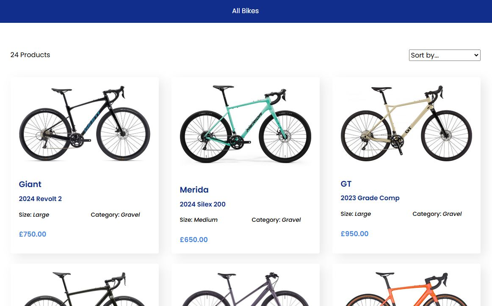
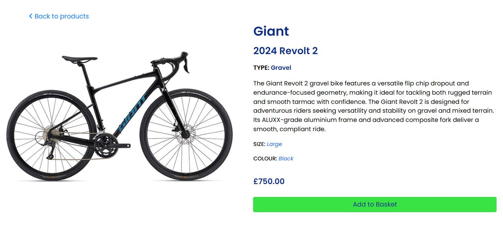
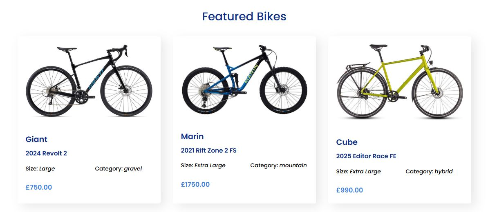
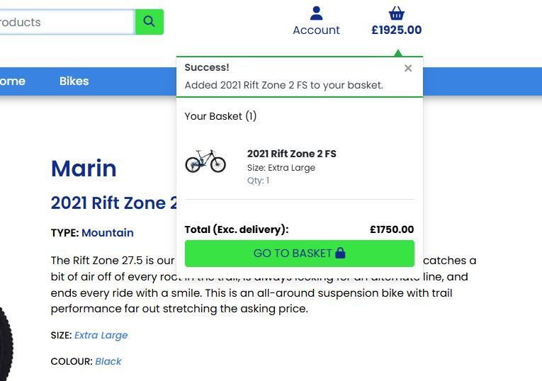
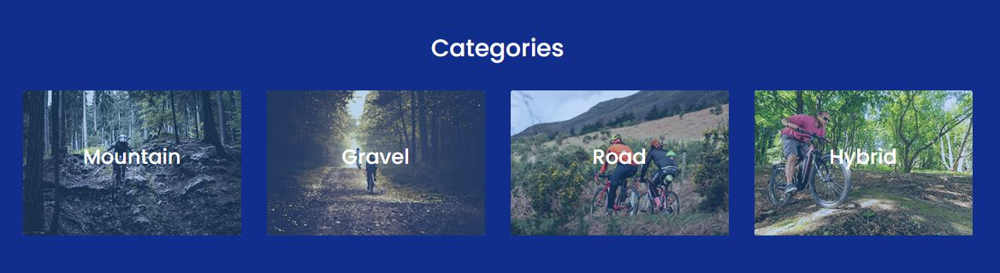
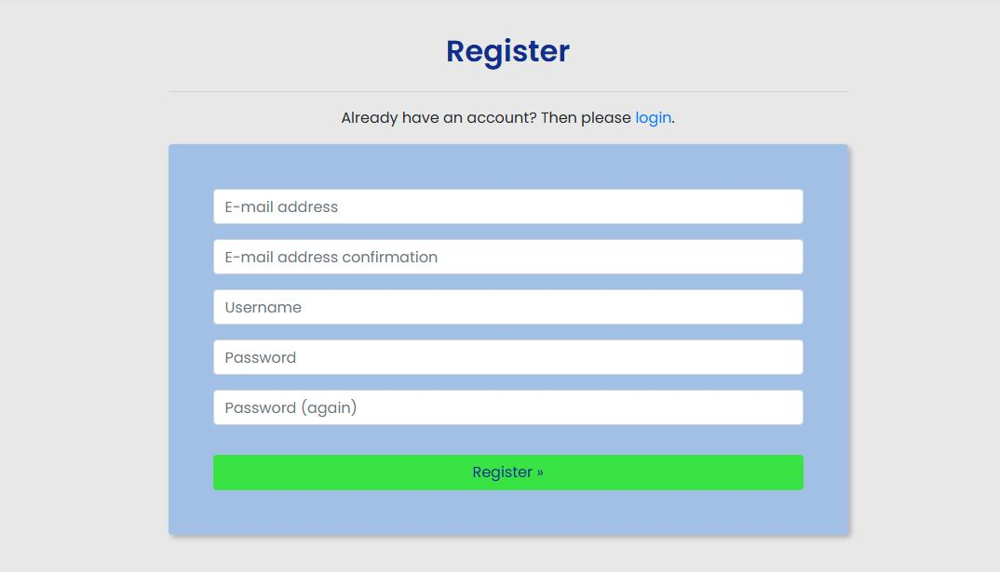
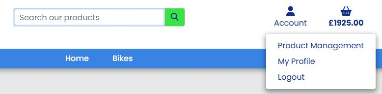

# Testing

---

## Table of Contents

1. [User Stories](#user-stories)
2. [Code Validation](#code-validation)
    + [HTML](#html)
    + [CSS](#css)
    + [Javascript](#javascript)
3. [Colour Contrast Validation](#colour-contrast-validation)
4. [Performance](#performance)
5. [Responsiveness](#responsiveness)
6. [Browser Compatibility](#browser-compatibility)
7. [Bugs and Fixes](#bugs-and-fixes)

---

## User Stories

### **Viewing and Navigation**

**View a list of bikes - I can see which bike(s) I would like to purchase**

Screenshots

+ From the moment the user visits the site, the home page has buttons that will take them to the products page showing the user all the bikes. The user also has the option to select between four categories that when the user clicks on, will take them to the products page but the bikes are filtered to just those types of bikes.

**View individual details about the bikes - I can see the price, description, product image and sizes**

Screenshots

+ Once the user clicks on any bike they will be taken to the product landing page that will provide the user with all the relevant details. These details include an image of the bike, followed by the brand name, model name, category, description, size, colour and the price. If the user would like to purchase the bike, there is an Add to Basket button at the bottom of the details.

**See the featured listings by default - I can see quickly and easily the featured bikes available to purchase**

Screenshots

+ The featured products can be seen from the home page. These bikes are chosen as featured by the admin.

**Easily view the bike(s) and the total purchase at any time - I can see how much I am spending**

Screenshots

+ The total purchase can be seen at every point in the navbar under the basket icon. The user can see exactly what they are ordering each time they add a product to the basket, this is by the means of messages that pop up just below the accounts and basket icons in the navbar.

**Clearly see the categories (Mountain, Gravel, Road and Hybrid) available for selection - I can see these from within the navbar and the home page**

Screenshots

+ The user can see the categories clearly as they get to the site from the lower navbar under the bikes dropdown link. Should a new user scroll down the home page first they will also be able to see all four categories, mountain, gravel, road and hybrid in a section that shows the category image and the name overlayed on top of the image.

### **Registration and User Accounts**

**Easily register for an account - I can have a personal account to see and edit my profile and see purchase history**

Screenshots

+ If the user would like to register for an account they can do so, via the account dropdown in the navbar. They can also register for an account as you get to the checkout page, before the payment the user is offered the change to register for an account.

**Easily login or logout - I can see my personal details within my account**

Screenshots

**Login**

**Logout**

+ Logging in or logging out can be done from going to the account dropdown link. Logging out will require the user to confirm whether they would actually like to logout or not.