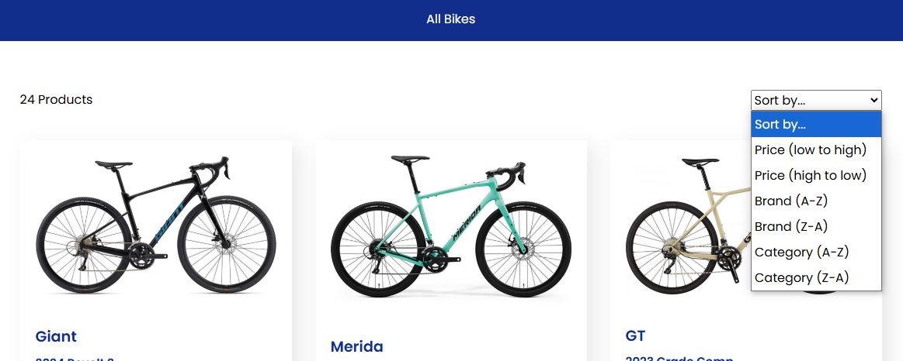

# Testing

---

## Table of Contents

1. [User Stories](#user-stories)
2. [Code Validation](#code-validation)
    + [HTML](#html)
    + [CSS](#css)
    + [Javascript](#javascript)
3. [Colour Contrast Validation](#colour-contrast-validation)
4. [Performance](#performance)
5. [Responsiveness](#responsiveness)
6. [Browser Compatibility](#browser-compatibility)
7. [Bugs and Fixes](#bugs-and-fixes)

---

## User Stories

### **Viewing and Navigation**

**View a list of bikes - I can see which bike(s) I would like to purchase**

Screenshots

+ From the moment the user visits the site, the home page has buttons that will take them to the products page showing the user all the bikes. The user also has the option to select between four categories that when the user clicks on, will take them to the products page but the bikes are filtered to just those types of bikes.

**View individual details about the bikes - I can see the price, description, product image and sizes**

Screenshots

+ Once the user clicks on any bike they will be taken to the product landing page that will provide the user with all the relevant details. These details include an image of the bike, followed by the brand name, model name, category, description, size, colour and the price. If the user would like to purchase the bike, there is an Add to Basket button at the bottom of the details.

**See the featured listings by default - I can see quickly and easily the featured bikes available to purchase**

Screenshots

+ The featured products can be seen from the home page. These bikes are chosen as featured by the admin.

**Easily view the bike(s) and the total purchase at any time - I can see how much I am spending**

Screenshots

+ The total purchase can be seen at every point in the navbar under the basket icon. The user can see exactly what they are ordering each time they add a product to the basket, this is by the means of messages that pop up just below the accounts and basket icons in the navbar.

**Clearly see the categories (Mountain, Gravel, Road and Hybrid) available for selection - I can see these from within the navbar and the home page**

Screenshots

+ The user can see the categories clearly as they get to the site from the lower navbar under the bikes dropdown link. Should a new user scroll down the home page first they will also be able to see all four categories, mountain, gravel, road and hybrid in a section that shows the category image and the name overlayed on top of the image.

### **Registration and User Accounts**

**Easily register for an account - I can have a personal account to see and edit my profile and see purchase history**

Screenshots

+ If the user would like to register for an account they can do so, via the account dropdown in the navbar. They can also register for an account as you get to the checkout page, before the payment the user is offered the change to register for an account.

**Easily login or logout - I can see my personal details within my account**

Screenshots

**Login**

**Logout**

+ Logging in or logging out can be done from going to the account dropdown link. Logging out will require the user to confirm whether they would actually like to logout or not.

**Easily recover my password - I can recover access to my account**

Screenshots

**Page**

**Email**

+ If the user has forgotten their password, they can easily reset their password by clicking on the link that is found on the login page. This will take them to the password reset page, where they will need to enter their email address. An email will be sent to the chosen email address where the user will have a link in the email to click, that will take them directly to the page to reset password.

**Have a personalised user profile - I can view my order history, update billing info, save payment information**

Screenshots

+ The user is given the option to register in order for them to create their profile page and see previous orders. The profile page will allow the user to save personal information that will save the user time next time they come to placing a new order. They will also be able to see previous orders in a list that when they click on the order number will take them to the order summary page, providing details on what they've ordered and the cost associated to that order.

**Receive an email confirmation after registering - I can see that my account was successfully setup**

Screenshots

**Verify Email Page**

**Verify Email**

**Verify Email Confirmaion**

+ Once a user registers for an account they will be prompted with instructions that an email has been sent to the specified email address upon registration. Within the actual email, will be a link that once clicked will take the user to the email confirmation page, confirming that registration has been setup succesffully.

### **Sorting and Searching**

**Sort products by brand name, price and category - I can narrow down my search to identify a specific bike to buy**

Screenshots

+ The site has a sort by function that is located at the top of the products page. Users can sort by brand name, price and category and once they choose an option, this will be applied to the products on the page.

**Search for a product by name or description - I can find a specific bike I'd like to buy**

Screenshots

+ The searchbar is featured on desktops in the centre of the navigation bar. On tablets and mobiles the layout is changed so that the search bar sits below the icons and navigation menu. This is to allow easy access for users to search at any given time with ease. They will be able to search by either name or description.

**See what I've searched for and the results - I can see whether the product I'd like to buy is in the results**

Screenshots

+ Once a user searches for a bike they will be presented with the results on the page. On the top left hand side of the page will show the user the number of results and what they inputted into the searchbar.

**See if there are no search results - I can quickly determine that there are no products that match**

Screenshots

+ Should the user type into the searchbar and no results be returned, they will again be shown on the top left as zero with what was typed also displayed.

### **Purchasing and Checkout**

**View items in the basket - I can see exactly what I'm ordering and how much the total cost will be**

Screenshots

+ The basket shows a list of exactly what the user is wanting to order. Each order line contains a thumbnail of the bike, enabling the user to easily identify what they have added. This is followed by the brand name, model name, colour, size, price, quantity and subtotal. At the bottom of the list the user will see basket total, delivery and grand total, allowing the user to see exactly how much the total order is before going to the checkout.

**Easily enter my payment information - I can checkout with no issues**

Screenshots

+ At the checkout stage the user will need to provide both personal details, delivery address and then payment information. The users will need to input their card details, expiry date and postcode in order for them to securely checkout through a Stripe payment. The user will know just after if the order has been submitted successfully as they will be taken to the order summary page.

**Feel my personal details and payment information is secure - I can have the confidence to provide and input my payment details**

Screenshots

+ The user will confidentily be able to provide all payment information allowing them checkout feeling that there payment will go through securely.

**View an order confirmation after checkout - I can make sure my order has gone through successfully and I haven't made any mistakes**

Screenshots

+ Once a user has placed an order they will be taken to the order confirmation page, providing the user with a breakdown of what the user has ordered and the costs associated with the order.

**Receive an email confirmation after checkout - I can have confirmation and proof of purchase for my records**

Screenshots

+ Once a user has placed an order they will be sent an order confirmation email, providing the user with a breakdown of what the user has ordered and the costs associated with the order.